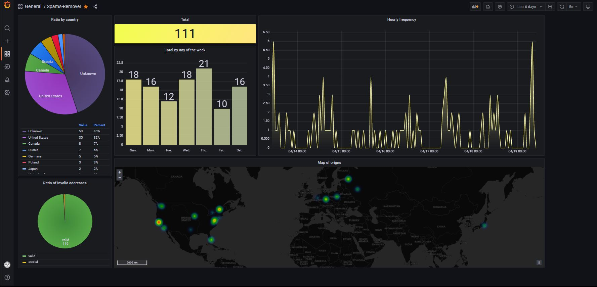

# spam-remover

  [](https://github.com/FlorentinTh/spam-remover/blob/master/LICENSE) [](https://github.com/FlorentinTh/spam-remover/actions/workflows/dependencies.yml) [](https://github.com/FlorentinTh/spam-remover/actions/workflows/build.yml) [](https://github.com/FlorentinTh/spam-remover/releases)

Clean Gmail account from spam messages that keep stacking in your mailbox.

## Authors

- [**Florentin Thullier**](https://github.com/FlorentinTh) - 2022


## Instructions

1. Copy your ```credentials.json``` and ```token.json``` files in the root project folder inside a ```.secrets``` folder.

    > **Note:** instructions to obtain such files are provided in the [Google documentation](https://developers.google.com/workspace/guides/create-credentials).

2. Adapt the content of ```.env.example``` according to your needs and rename the file as ```.env```.


## Example

You can use this project as a cron job. The example below shows how to run automatically the cleanup forever at every hour and log the output in a dedicated file.

```sh
# get the location of node binaries:
$ which node
> /usr/bin/node

# edit crontab file:
$ contrab -e

# add the following lines to the end of the file:
PATH=$PATH:/usr/bin/
0 * * * * node $HOME/spam-remover/bin/spam-remover.js >> $HOME/spam-remover/logs/spam-remover.log 2>&1
```

## Logging

The application is logging spam addresses as well as detailed domain related information from the sending server to a Timescale database.

> **Note:** see the [official documentation](https://www.postgresql.org/docs/14/installation.html) to install a self-hosted Postgres instance as well as the [other official documentation](https://docs.timescale.com/install/latest/self-hosted/) to enable Timescale related capabilities.

SQL commands to make this project work:

```sql
-- create a dedicated database:
CREATE DATABASE IF NOT EXISTS spams_remover;

-- enable the use of timescale:
CREATE EXTENSION IF NOT EXISTS timescaledb CASCADE;

-- set your timezone. For example:
SET timezone = 'America/Montreal';

-- create the required table:
CREATE TABLE IF NOT EXISTS spams (
   time               TIMESTAMPTZ NOT NULL,
   email              TEXT NOT NULL,
   ip                 TEXT NULL,
   hostname           TEXT NULL,
   city               TEXT NULL,
   region             TEXT NULL,
   country            TEXT NULL,
   location_latitude  NUMERIC NULL,
   location_longitude NUMERIC NULL,
   organization       TEXT NULL,
   is_email_valid     BOOLEAN NOT NULL
);

-- Enable the hyper table capability of timescale:
SELECT create_hypertable('spams','time');

-- To import previous exported data formatted in CSV:
\copy spams(time, email, ip, hostname, city, region, country, location_latitude, location_longitude, organization, is_email_valid)
      from './spams.csv' WITH DELIMITER ';' CSV HEADER;
```

A sample of data can be found in ```data/spams.csv```.

## Visualization

It is possible to visualize the data stored in the Timescale database through a custom Grafana dashboard. To set up a Grafana instance and link your Timescale database to it, you should refer to the [official documentation](https://docs.timescale.com/timescaledb/latest/tutorials/grafana/#getting-started-with-grafana-and-timescaledb). An example of a custom dashboard, shown as follows, is provided in ```grafana/dashboard.json```.



## License

This project is licensed under the MIT License - see the [LICENSE](LICENSE) file for details.
